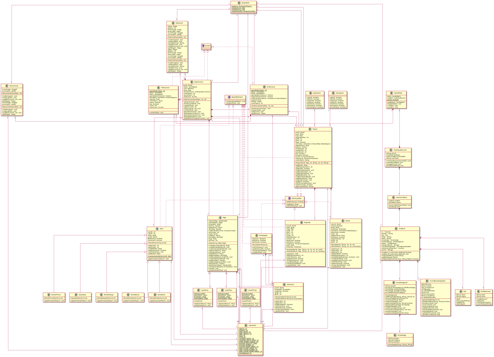

<p align="center">
    <br />
    
    <h1 align="center">A Bomberman-esque game that is actually fun!</h1>
</p>

<p align="center">
    <i>PokeBombz is a Bomberman-esque game built with the LibGDX framework in Java.</i>
    <br /><br />
    
    
    
</p>

<hr>

## Documentation

Get started with PokeBombz

-   [Setup](#setup)
    -   [Building from source](#building-from-source-and-running)
    -   [Run pre-built jar file](#run-pre-built-jar-file)
-   [Instructions](#instructions)
    -   [Keyboard Controls](#keyboard-controls)
    -   [Controller Controls](#controller-controls)
    -   [Chatbot Commands](#chatbot-commands)
        -   [Game](#game)
        -   [Scoring](#scoring)
        -   [Miscellaneous](#miscellaneous)
-   [UML Diagram](#uml-diagram)

## Setup

### Building from source and running

MacOS and Linux

```
./gradlew desktop:run
```

Windows

```
.\gradlew.bat desktop:run
```

### Run pre-built jar file

Download from the [release](https://github.com/sgtechICT1009/ict1009-team01-2022/releases) page

Windows and Linux

```
java -jar PokeBombz.jar
```

MacOS

```
java -XstartOnFirstThread -jar PokeBombz.jar
```

## Instructions

### Keyboard Controls

| Player | Movement           | Place Bomb  | Kicking | Throwing |
| ------ | ------------------ | ----------- | ------- | -------- |
| 1      | WASD               | Backspace   | -       | =        |
| 2      | TFGH               | \           | [       | ]        |
| 3      | IJKL               | Enter       | ;       | '        |
| 4      | Up Down Left Right | Right Shift | .       | /        |

### Controller Controls

| Movement | Place Bomb | Kicking | Throwing |
| -------- | ---------- | ------- | -------- |
| D-Pad    | A          | L1      | R1       |

## Chatbot Commands

#### IMPORTANT

| Player | Target |
| ------ | ------ |
| 1      | p1     |
| 2      | p2     |
| 3      | p3     |
| 4      | p4     |

### General

Exit game program:

```
exit
```

Exit to main menu:

```
exit main menu
```

Open help file:

```
help
```

### Game

Change player speed:

```sh
# Target all players
change speed <speed:int>

# Target specific player
change speed <speed:int> <player:target>
```

Change player bomb count:

```sh
# Target all players
change bomb count <count:int>

# Target specific players
change bomb count <count:int> <player:target>
```

Change player bomb range:

```sh
# Target all players
change bomb range <range:int>

# Target specific players
change bomb range <range:int> <player:target>
```

Change player bomb kick ability:

```sh
# Target all players
change kick bomb

# Target specific players
change kick bomb <player:target>
```

Change countdown timer:

```sh
# Between 50-500 inclusively
change death timer <time:int>
```

Change item spawn rate:

```sh
# Between 0-100 inclusively
change spawn chance <rate:int>
```

Starts sudden death immediately:

```sh
start sudden death
```

### Scoring

All players scores revert to 0

```
reset score
```

Uploads score to database

```sh
# Add score to database
update new score

# Overwrite specific ID in database
upload score id <number:int>
```

### Miscellaneous

_Any command that starts with "who", "what" and "how" would be will be presumed to be a question._

_The chatbot would reply the question according to its database._

_If the data isn't present, it would reply that it doesn't understand the question and expects the user to reply with an answer and save it to the database._

Load current information:

```
load
```

Reset chatbot database to defaults

```
reset
```

Save information into database

```
save
```

## UML Diagram

[](docs/Project_UML_Diagram.png)
